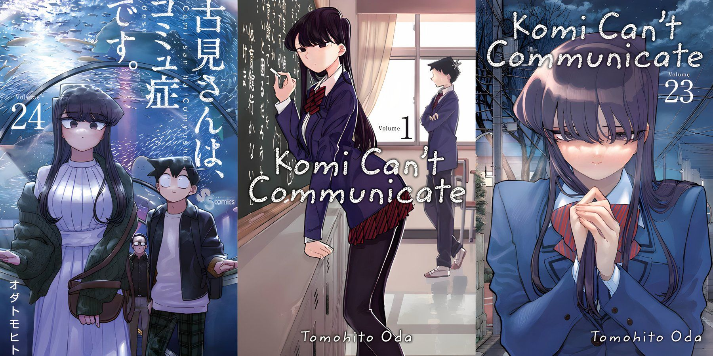

# Komi Can't Communicate

This is one of those romance anime i watched during the pandemic. That despite becoming a little boring later on. It's a good fluttering watch during it's special moments.

## Info:
Komi Can't Communicate is a Japanese manga series written and illustrated by Tomohito Oda. The story centers around Shoko Komi, a high school girl who has extreme social anxiety and struggles to communicate with others. With the help of her classmate Hitohito Tadano, they embark on a mission to make 100 friends and improve Komi's communication skills. 

## Characters:
Im gonna be listing notable characters each from the following:
1. Main characters
2. Supporting characters
3. Antagonist characters

> The reason why im only listing few is due to the series having more than 50+ characters. This is simply because the series gave all characters some depth instead of adding them as a background character.

### Main characters
|      Name       | Notes                                                                                                                                                                                                                                                                                                |
|:---------------:|:-----------------------------------------------------------------------------------------------------------------------------------------------------------------------------------------------------------------------------------------------------------------------------------------------------|
|   **Komi Shouko**   | Even in childhood up to the time of the story. *Komi is unable to socialize to a point it can be called a communication disorder.* However she wishes to overcome this issue of hers and dreams of having 100 friends                                                                                  |
| **Tadano Hitohito** | In his early days he had a chuunibyou  phase and confessed to someone. However he was rejected this causes him to be self-conscious and change to not stand out. *He posses great observational skills that allowed him to learn of Komi's issues allowing him to help her achieve having 100 friends* |
| **Manbagi Rumiko**  | Appears later on the story. She originally liked Komi however she became the conflict of the story. As at the time Komi and Tadano were starting to have a romantic relation. *Where Rumiko was also revealed to like Tadano*                                                                          |

### Supporting characters
|     Name     | Notes |
|:------------:|:-----:|
| **Najimi Osana** |*An cheerful. Hyperactive and extroverted supporting character.* Najimi also later helps with Komi's dream of having 100 friends together with Tadano|
| **Katai Makoto** |*Another person who has issues in communication.* He became a note that Komi is not the only one suffering from a communication disorder.|
| **Onemine Nene** |She is introduced as *a big sister kind of figure to everyone around her specially to Komi and Tadano*. She is also observant as well knowing that Tadano and Komi had something going between each other romantically before they even knew. Which in the story she put her full support to Komi.|

### Antagonist character
|   Name    | Notes |
|:---------:|:-----:|
| **Yamai Ren** |*She has an obsession with Komi*. Resulting to one part where she kidnapped Tadano in attempt to keep Komi for herself. Later in the story she does get some character development and back story as to why she is this way|

## So what did i learn?
Aside from the romance aspect. What made this series of note for me is due a very simple reason. All characters had depth. They had personalities, Interest, likes and dislikes, romance. Etc. In short each character had their own mini-stories. Not just the protagonist or antagonist. This became something i remembered specially when i watched this during the pandemic where many anime really just became repetitive and boring.

## References:
> [Wikipedia: Komi Can't Communicate](https://en.wikipedia.org/wiki/Komi_Can't_Communicate)
> [Fandom: KCC Characters](https://komisan.fandom.com/wiki/Category:Characters)
